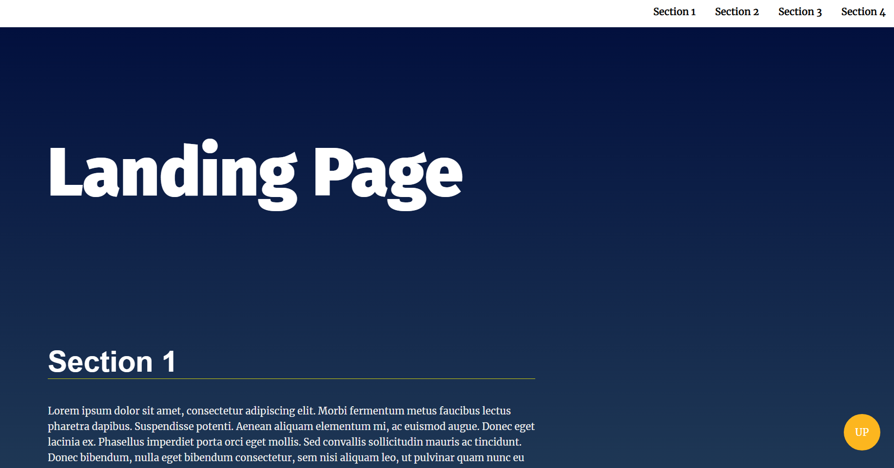

# Landing Page

Welcome to the Landing Page repository! This repository contains the source code for a landing page template built using HTML, CSS, and JavaScript. This template is fully responsive.

<h1 align="center">
    
</h1>

## ⭐ Features
- [x] Fully responsive design that looks great on any device
- [x] Animated scrolling navigation 
- [x] Dynamic nav-bar

## Built With
* HTML
* CSS
* JavaScript

Note: I coded the javascript code and edited html and css code which provided by Udacity. 

---

## How to Use

1. Clone or download the repository.
2. Open the `index.html` file in your browser to view the landing page.
3. Customize the HTML, CSS, and JavaScript to suit your needs.

## Contributions

I welcome contributions to this repository, whether in the form of bug fixes, new features, or design improvements. If you would like to contribute, please create a pull request and I will review it as soon as possible.

Thank you for visiting the Landing Page repository! I hope it helps you create a beautiful and functional landing page.

## Resource

This project was developed in [Professional Front-End Web Development track](https://egfwd.com/specializtion/web-development-professional/) which provided by [Udacity](https://www.udacity.com) and [EGFWD](https://egfwd.com/). 

Developed by [@Aly Qamar](https://www.linkedin.com/in/alyqamar) - alyelsamouly@gmail.com
